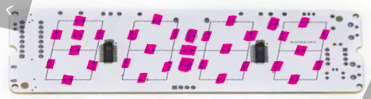

# LED physical layout

The clocks I have have thirty three LED positions. A gradient or
a wipe needs to know the exact layout, and the logical COM and SEG map in `display-map.md` does
not carry it.

Coordinates were extracted from that photo by thresholding the highlight color
into blobs, then fitting an affine transform to the twenty eight segment pads.

## Coordinates

`id` is a position number, and is what `set_position_color` takes.

`nx` runs 0 at the left edge of the first digit to 1 at the right edge of the
last, `ny` 0 at the top of a digit to 1 at the bottom. The lit area measures
roughly 108 x 25mm.

Within a digit the walk is A, F, G, E, D, C, B, a counterclockwise loop from
the top with G taken in the middle. So the first id of each digit is its top
segment.

| id | Block | Digit | Position | nx | ny |
| --- | --- | --- | --- | --- | --- |
| 1 | 0 | Hour tens | Segment A, top | 0.075 | 0.033 |
| 2 | 0 | Hour tens | Segment F, top left | 0.001 | 0.258 |
| 3 | 0 | Hour tens | Segment G, middle | 0.080 | 0.511 |
| 4 | 0 | Hour tens | Segment E, bottom left | 0.000 | 0.739 |
| 5 | 0 | Hour tens | Segment D, bottom | 0.075 | 1.000 |
| 6 | 0 | Hour tens | Segment C, bottom right | 0.157 | 0.762 |
| 7 | 0 | Hour tens | Segment B, top right | 0.162 | 0.257 |
| 8 | 0 | Hour tens | AM mark | 0.079 | 0.256 |
| 9 | 1 | Hour ones | Segment A, top | 0.364 | 0.000 |
| 10 | 1 | Hour ones | Segment F, top left | 0.286 | 0.255 |
| 11 | 1 | Hour ones | Segment G, middle | 0.360 | 0.487 |
| 12 | 1 | Hour ones | Segment E, bottom left | 0.282 | 0.722 |
| 13 | 1 | Hour ones | Segment D, bottom | 0.353 | 0.964 |
| 14 | 1 | Hour ones | Segment C, bottom right | 0.437 | 0.778 |
| 15 | 1 | Hour ones | Segment B, top right | 0.440 | 0.240 |
| 16 | 1 | Hour ones | Colon, upper dot | 0.503 | 0.268 |
| 17 | 2 | Minute tens | Date dash | 0.502 | 0.503 |
| 18 | 1 | Hour ones | Colon, lower dot | 0.505 | 0.741 |
| 19 | 2 | Minute tens | Segment A, top | 0.640 | 0.018 |
| 20 | 2 | Minute tens | Segment F, top left | 0.561 | 0.273 |
| 21 | 2 | Minute tens | Segment G, middle | 0.642 | 0.478 |
| 22 | 2 | Minute tens | Segment E, bottom left | 0.570 | 0.739 |
| 23 | 2 | Minute tens | Segment D, bottom | 0.648 | 0.967 |
| 24 | 2 | Minute tens | Segment C, bottom right | 0.727 | 0.766 |
| 25 | 2 | Minute tens | Segment B, top right | 0.725 | 0.264 |
| 26 | 3 | Minute ones | Degree mark | 0.800 | 0.069 |
| 27 | 3 | Minute ones | Segment A, top | 0.913 | 0.043 |
| 28 | 3 | Minute ones | Segment F, top left | 0.848 | 0.266 |
| 29 | 3 | Minute ones | Segment G, middle | 0.923 | 0.502 |
| 30 | 3 | Minute ones | Segment E, bottom left | 0.847 | 0.761 |
| 31 | 3 | Minute ones | Segment D, bottom | 0.919 | 0.977 |
| 32 | 3 | Minute ones | Segment C, bottom right | 0.999 | 0.747 |
| 33 | 3 | Minute ones | Segment B, top right | 1.000 | 0.237 |

The same table is compiled into the ESPHome component as `GEOM[4][9]`, indexed
by block and by the segment order in `SEGMAP`, with the coordinates scaled to
0 to 255. An id of 0 there marks one of the three addressable positions with
nothing wired to it.

Segment coordinates follow from the seven segment convention, but nothing about
the wiring says the AM mark sits in the middle of the hour tens digit, or that
the degree mark sits in the gap before the last digit rather than after it.

## What this is for

Color resolves in three tiers. A position with its own color wins, then the
digit it belongs to, then the master light. `set_gradient` writes the position
tier for every LED at once.

A gradient is a linear ramp between two colors, projected onto an axis at any
angle. It is normalized against the LEDs themselves rather than the panel
outline, so both colors land exactly on the outermost LEDs whichever way the
ramp points.

Normalizing against the corners leaves both ends short, because no LED sits in
a corner.

Per position color costs nothing in the scan. The step count is four COM pairs
times four sub-frames whatever the content, so more colors mean less merging
and never more steps.
